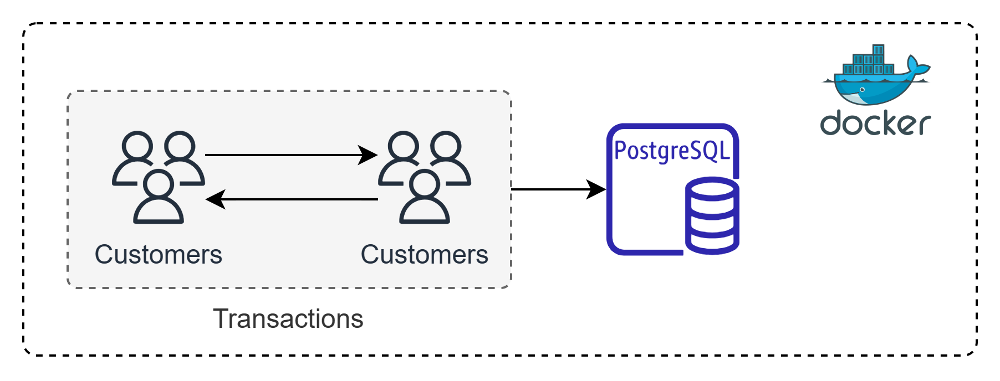
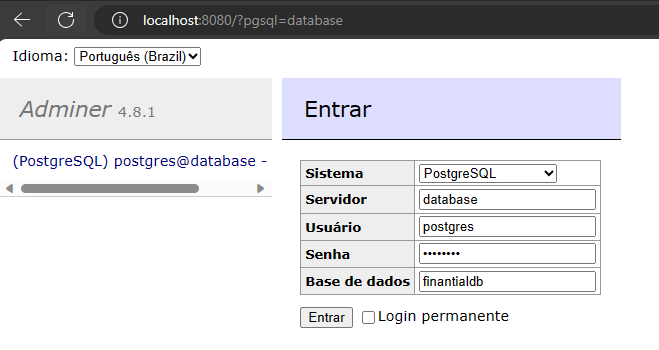

# Financial Data Storage 📊



This repository contains a sample user transaction database over a period of 1 year.

## Technologies 🛠️

* Docker 🐳
* Postgres 🐘
* Python 🐍

## Model Entity Relationship (MER) 🗄️

This project revolves around three key entities:

1. **Customers** 👤: These are the bank's valued users.
2. **Accounts** 💳: Represents user accounts across different banks.
3. **Transactions** 📈: Captures user account transactions.


Dive into the `/sql/init.sql` file for a detailed `SQL` script with all entity definitions.

## Running the Project 🚀

Para executar este projeto siga estas etapas:

1. Clone the repository from GitHub:

```shell
git clone https://github.com/Matheus1714/financial-data-storage.git
```

2. Ensure you have [Docker](https://www.docker.com/) installed on your machine.

3. Open your terminal and navigate to the project's root directory.

4. Run the following command:

```shell
docker-compose up --build
```

This command orchestrates the magic defined in the `docker-compose.yaml` file. It'll spin up the database and populate it with the wealth of information encapsulated in the entity relationship model.

The database population process is orchestrated by the `mock_dataset.py` file.

## Accessing the Database 📡

Accessing the database is a breeze! Connect using the following credentials:

```python
DB_USER = 'postgres'
DB_PASSWORD = 'postgres'
DB_NAME = 'finantialdb'
BD_PORT = 2222
```

For local runs, set the host as `localhost` or `0.0.0.0`.

Hungry for data insights? Simply visit `localhost:8080 `in your browser.



## Docker Tasks at a Glance 🐋

### Task: Configure the Database

```yaml
database:
    image: postgres
    ports:
      - "2222:5432"
    environment:
      POSTGRES_USER: postgres
      POSTGRES_PASSWORD: postgres
      POSTGRES_DB: finantialdb
    command: [ "postgres", "-c", "log_statement=all" ]
    restart: always
    volumes:
      - ./sql/init.sql:/docker-entrypoint-initdb.d/init.sql
```

### Task: Database Interface

```yaml
adminer:
    image: adminer
    restart: always
    depends_on:
      - database
    ports:
      - 8080:8080
```

### Task: Configure Mock Dataset

```yaml
mock_app:
    build:
      context: .
      dockerfile: Dockerfile.mock_app  # Specify the Dockerfile for your mock app
    depends_on:
      - database
```

## License 📜

This project is open-source and is distributed under the MIT License. Feel free to explore, modify, and utilize the codebase according to the terms outlined in the license. 🤝🌟